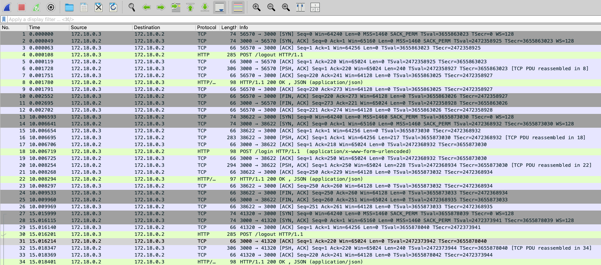
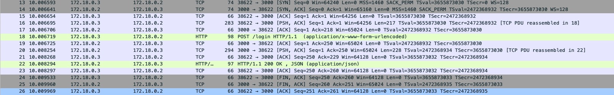
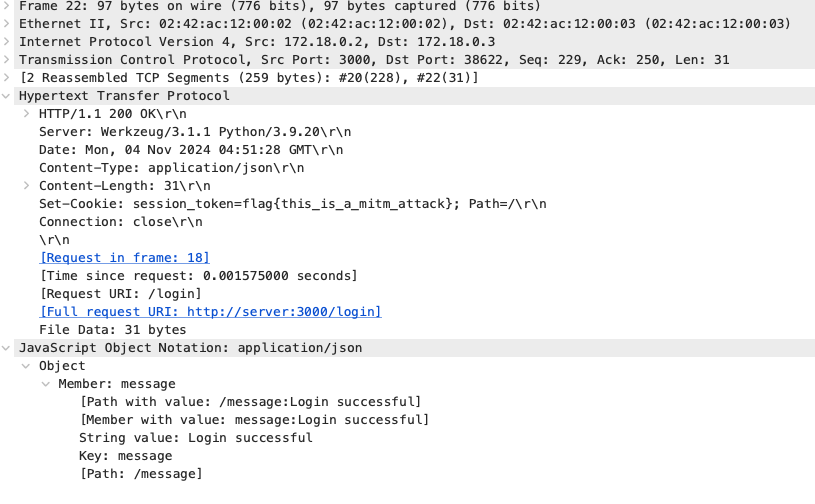
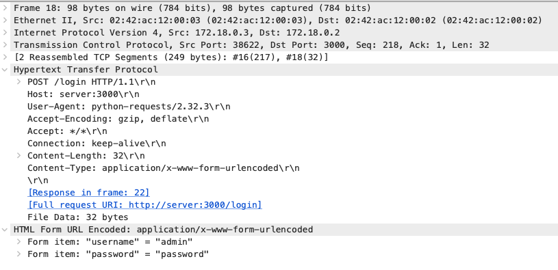

## Challenge: Man-in-the-Middle Attack Session Capture (Beginner)

### Objective
Perform a man-in-the-middle attack to intercept the data between the client and server. Caputure the Session token for the admin.

### Write-up
In this challenge, we are given that there is a client-server communication happening on port 3000. The client is sending a message to the server, and the server is responding with a message. Our objective is to intercept the data between the client and server.

To perform the man-in-the-middle attack, we need to set up a interceptor to capture the packets between the client and server. 
We first connect to the docker container and install the tcpdump tool to capture the packets.
```bash
docker ps
docker exec -it <container_id> /bin/bash
apt-get update
apt-get install -y tcpdump
```

Next, we run the tcpdump tool to capture the packets for network traffic.
```bash
tcpdump -i eth0 -w /tmp/capture.pcap
```

Now, we could use Wireshark tool to analyse the captured packets. 



We can see that there are packets sending between ip 172.18.0.3 and 172.18.0.2. And they are using TCP and HTTP protocol. Therefore we can determine that this communication is two hosts communicating over HTTP.

We can clearly see that the TCP 3-way handshake is happening before every HTTP request and response. We can also see the ip 172.18.0.3 is sending a POST request to ip 172.18.0.2. Therefore, we can determine that 172.18.0.3 is the client and 172.18.0.2 is the server.

#### Login packets

This section show the login packets. We can first see the client send the syn packet to the server. The server then responds with a syn-ack packet. The client then sends an ack packet to the server. This completes the TCP 3-way handshake. The client then sends a POST request to the server to login using HTTP protocol. 

The server then send a ACK packet and PUSH ACK packet to the client. The client then sends a ACK packet to the server. This completes the another TCP 3-way handshake. This ensures that the client and server are ready to communicate.

The server then sends a response to the client with the message "Login Successful". The client then sends a ACK packet and FIN ACK packet to the server. The server then sends a FIN ACK packet to the client to close the connection.

#### Interesting packets
Our objective is to capture the session token for the admin. We can see the session token in the response from the server.


This is the packet of the response from the server. We can see that the response contains a JSON object with the message "Login Successful". And on the HTTP header, we can see that there is a attribute called "Set-Cookie" with the session token. This is the session token for the admin that we need to capture.

Another interesting packet is the packet of the POST request from the client. We can see that the client is sending a POST request to the server with the login credentials.

